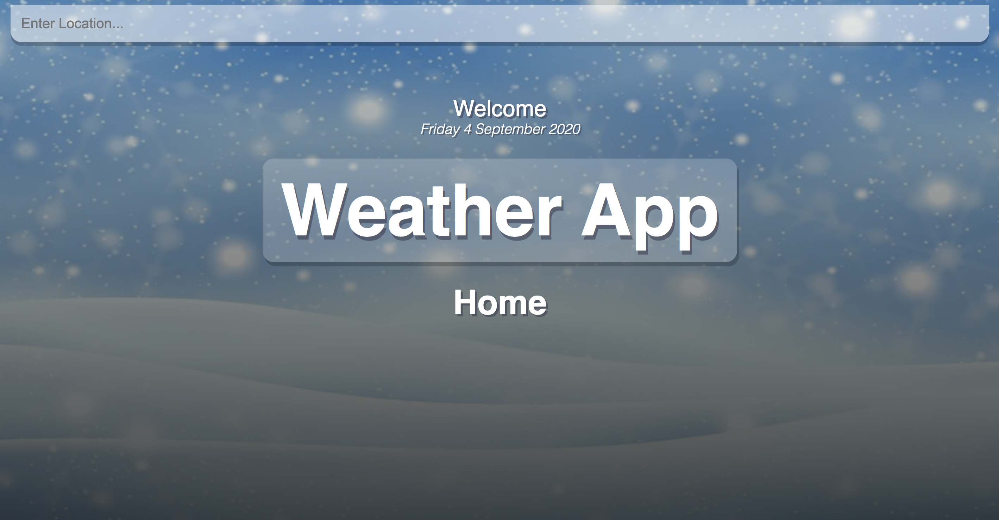

[](https://vibrant-stonebraker-f67b74.netlify.app/)
# Weather App
My weather app was created with react and has a dynamic background that is related to the temperature of the location. If warm, a warm background will be given and if cold, a cold background will be given.

You can view a live version at: (will be redirected to)

- [click here](https://vibrant-stonebraker-f67b74.netlify.app/)

or copy and paste the link below:
```
> https://vibrant-stonebraker-f67b74.netlify.app/
```


## Links

- [My portfolio](https://ridwan.co.uk/)
- [By me a coffee](https://ko-fi.com/R1D1M1LL)

